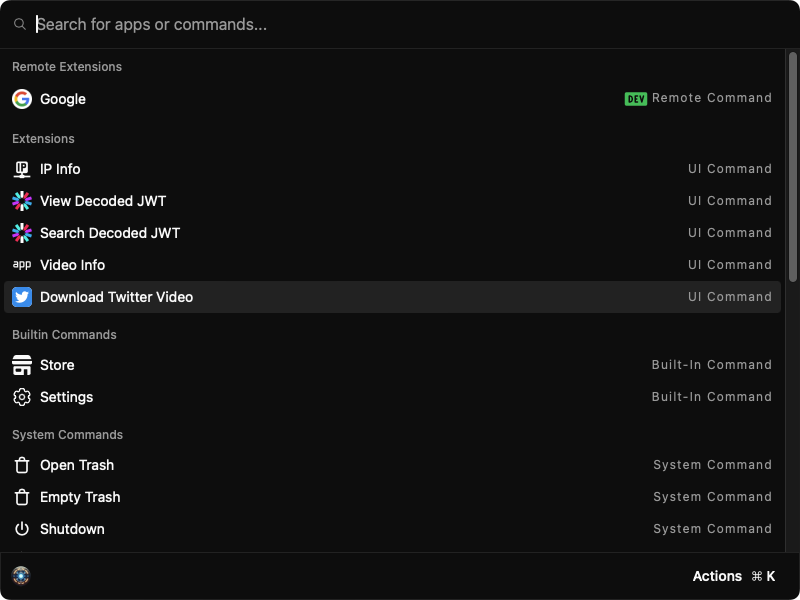
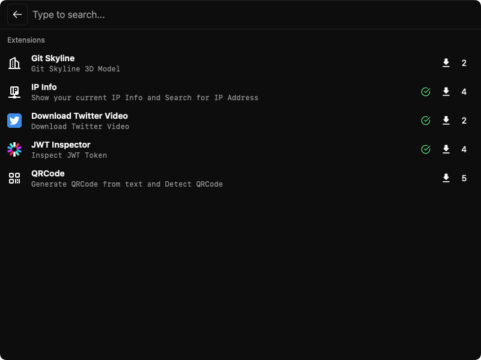

# Kunkun

[Discord Server](https://discord.gg/bvf6GwxKWX)

> Kunkun is a cross-platform extensible app launcher like Raycast or Alfred.

## Documentation: https://kunkun.sh/

## Platforms

- [x] MacOS
- [x] Linux
- [x] Windows

## Demo

