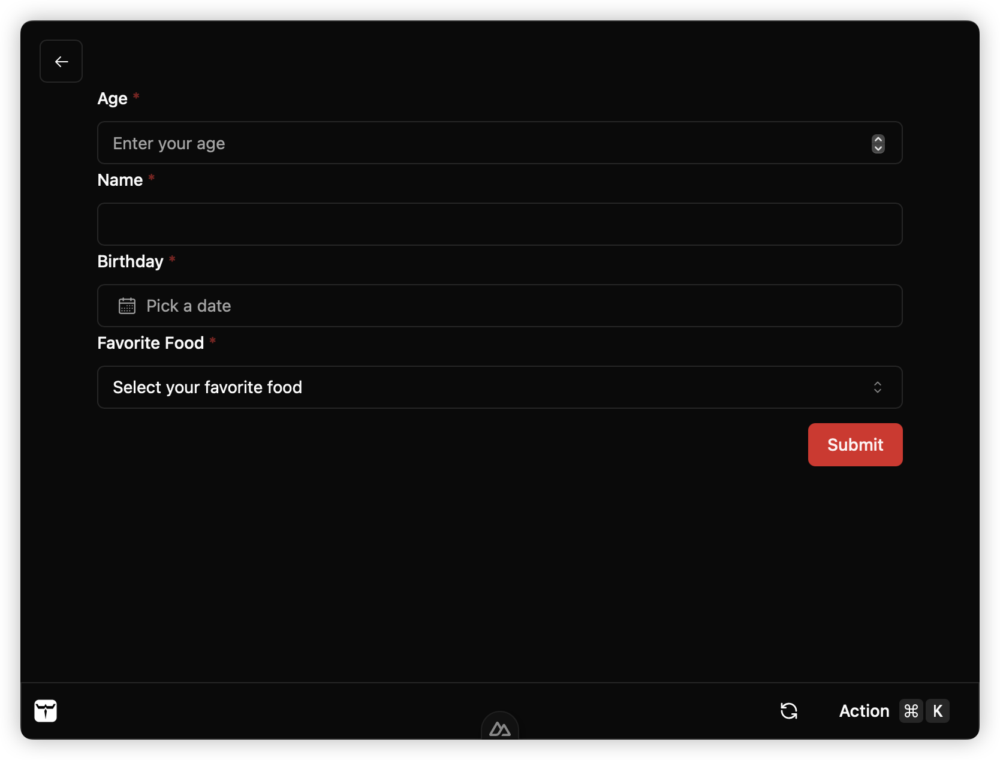
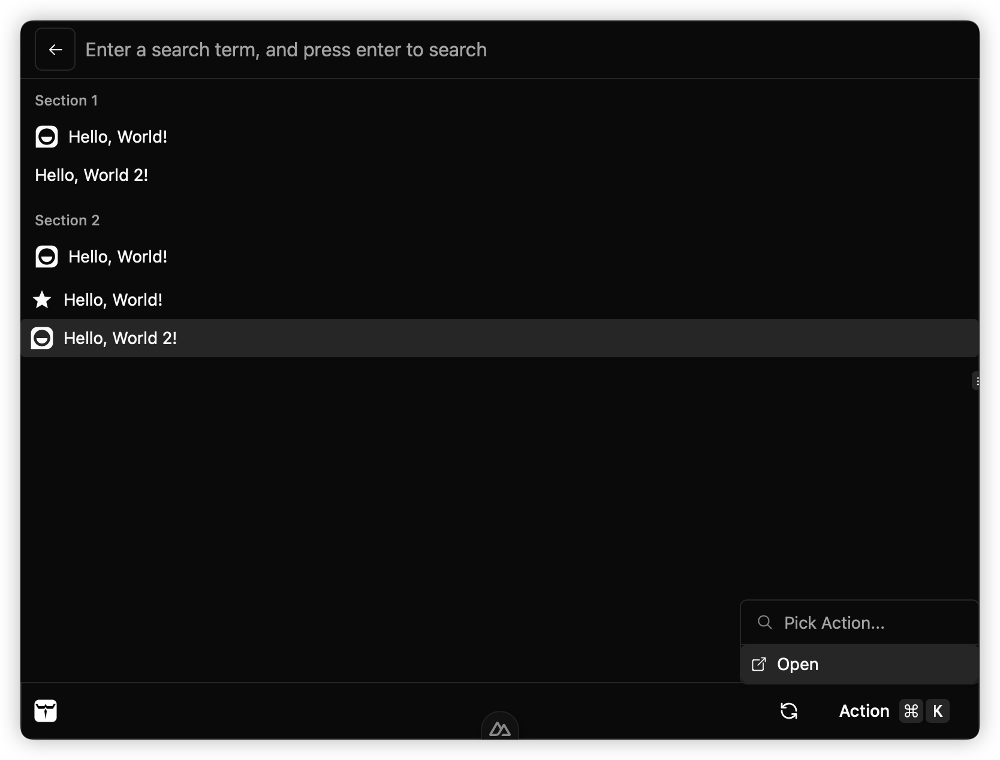

Worker Template Extension is a kind of lightweight extension running in web worker, 
following pre-defined template, making it easy to develop extension with consistent GUI.

## Installation

Run the project scaffolding command to create a new project with Worker Template Extension.

```bash
npm init kunkun@latest --template template
```

After creating a template project, you need to edit `package.json`.

## Development

```bash
npm run build # build the extension, generate dist/index.js file, this is the entry file of the extension, make sure it's listed in the package.json
npm run dev # start the development server, basically running rollup compile with watch mode
```

The `@kksh/api/dev` subpackage provides a `kununWorkerTemplateExtensionRollupPlugin` function.
This is a rollup plugin used to hot reload the extension in development mode. 

In dev mode (`npm run dev`), every time you save the file, the extension will be recompiled and Kunkun desktop app will be notified to reload the extension.
Otherwise you need to manually reload the extension.

The template should come with the `kununWorkerTemplateExtensionRollupPlugin` plugin already configured in the rollup config file.


A template worker extension should extends abstract class `WorkerExtension` (https://docs.api.kunkun.sh/classes/ui_worker.WorkerExtension)

Override the methods of this class to implement your extension.

- `load`
- `onSearchTermChange`
- `onActionSelected`
- `onEnterPressedOnSearchBar`

**List View**

- `onListItemSelected`
- `onListScrolledToBottom`
- `onHighlightedListItemChanged`

**Form View**

- `onFormSubmit`

```ts
import { WorkerExtension, expose } from "@kksh/api/ui/worker"

class DemoExtension extends WorkerExtension {
	async load() {
    // load method is run when the extension is loaded, you can use it as an initializer
  }
}

expose(new DemoExtension()) // expose this extension at the bottom of the file
```

### Form View

A form can be easily rendered with the `ui` API. Every form field is an object.

Available form fields:
- `Form.InputField`
- `Form.NumberField`
- `Form.SelectField`
- `Form.BooleanField`
- `Form.DateField`
- `Form.ArrayField`
- `Form.Form`

```ts
import { WorkerExtension, expose, ui, Form } from "@kksh/api/ui/worker"

class DemoExtension extends WorkerExtension {
	async onFormSubmit(value: Record<string, any>): Promise<void> {
		console.log("Form submitted", value)
	}
	async load() {
		return ui.render(
			new Form.Form({
				key: "form1",
				fields: [
					new Form.NumberField({
						key: "age",
						label: "Age",
						placeholder: "Enter your age"
					}),
					new Form.InputField({
						key: "name"
					})
				]
			})
		)
  }
}
expose(new DemoExtension())
```



### List View

List view can contain sections and items. Everything is an object.

An list item can can title, value, icon and actions. 
Each item can contain multiple actions. When selected, `onActionSelected()` will be called.



```ts
import { 
  Action,
	expose,
  Icon,
	IconEnum,
	List,
  ui,
	WorkerExtension
 } from "@kksh/api/ui/worker"

class DemoExtension extends WorkerExtension {
	async onFormSubmit(value: Record<string, any>): Promise<void> {
		console.log("Form submitted", value)
	}
	async load() {
		return ui.setSearchBarPlaceholder("Enter search term").then(() => {
			return ui.render(
				new List.List({
					sections: [
						new List.Section({
							title: "Section 1",
							items: [
								new List.Item({
									title: "Hello, World!",
									value: "Section 1 Hello, World!",
									icon: new Icon({ type: IconEnum.Iconify, value: "gg:hello" })
								}),
								new List.Item({ title: "Hello, World 2!", value: "Section 1 Hello, World 2!" })
							]
						}),
						new List.Section({
							title: "Section 2",
							items: [
								new List.Item({
									title: "Hello, World!",
									value: "Section 2 Hello, World!",
									icon: new Icon({ type: IconEnum.Iconify, value: "gg:hello" })
								}),
							]
						})
					],
					items: [
						new List.Item({
							title: "Hello, World!",
							value: "Hello, World!",
							icon: new Icon({ type: IconEnum.Iconify, value: "ri:star-s-fill" })
						}),
						new List.Item({
							title: "Hello, World 2!",
							value: "Hello, World 2!",
							icon: new Icon({ type: IconEnum.Iconify, value: "gg:hello" }),
							actions: new Action.ActionPanel({
								items: [
									new Action.Action({
										title: "Open",
										icon: new Icon({ type: IconEnum.Iconify, value: "ion:open-outline" })
									})
								]
							})
						})
					]
				})
			)
		})
	}

	async onSearchTermChange(term: string): Promise<void> {
		console.log("Search term changed to:", term)
	}

	async onItemSelected(value: string): Promise<void> {
		console.log("Item selected:", value)
	}

	async onActionSelected(value: string): Promise<void> {
		console.log("Action selected:", value)
	}
}
expose(new DemoExtension())
```


